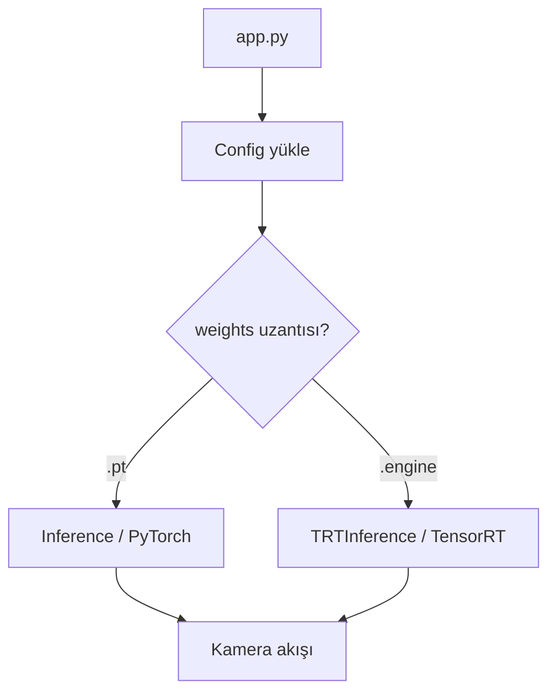

# YOLO TensorRT Pipeline

TOML tabanlı yapılandırma ile YOLO nesne tespiti yapan, PyTorch ve TensorRT çıkarımını destekleyen modüler bir pipeline.

## Features

- Tüm parametreler tek bir TOML dosyasından yönetilir, kod içinde hardcoded değer yoktur
- Ağırlık uzantısına göre PyTorch veya TensorRT çıkarımı otomatik seçilir
- ONNX export ve TensorRT engine derleme scriptleri (FP32 / FP16)
- Latency, throughput ve GPU bellek kullanımını ölçen benchmark aracı
- Ortam bazlı yapılandırma (`--env local`, `--env prod`)
- Loguru tabanlı seviyeli loglama

## Project Structure

```
.
├── app/
│   ├── config.py           # TOML config yükleyici
│   ├── logger.py           # Loglama sınıfı
│   ├── camera.py           # Kamera / video kaynağı
│   ├── inference.py        # PyTorch (Ultralytics) çıkarımı
│   ├── trt_inference.py    # TensorRT çıkarımı
│   ├── export_onnx.py      # PyTorch → ONNX
│   └── build_engine.py     # ONNX → TensorRT engine
├── configs/
│   ├── config.local.toml
│   └── config.prod.toml
├── models/
│   ├── pytorch/            # .pt dosyaları
│   ├── onnx/               # .onnx dosyaları
│   └── engine/             # .engine dosyaları
├── app.py                  # Giriş noktası
├── benchmark.py            # Performans karşılaştırması
└── requirements.txt
```

## Installation

```bash
conda create -n cv python=3.11 -y
conda activate cv
pip install -r requirements.txt
```

## Usage

### Çıkarım

```bash
python app.py --env local
```

Kullanılacak model `configs/config.local.toml` içindeki `weights` değeri ile belirlenir:

```toml
[inference]
weights = "models/pytorch/yolo26s.pt"        # PyTorch
# weights = "models/engine/yolo26s_fp16.engine"  # TensorRT
```

Uzantı `.engine` ise TensorRT, değilse PyTorch çıkarımı kullanılır.

### ONNX export

```bash
python -m app.export_onnx --env local
```

FP32 ve FP16 olmak üzere iki ONNX dosyası üretir.

### TensorRT engine derleme

```bash
python -m app.build_engine --env local
```

FP32 ve FP16 engine'lerini derler. Derleme birkaç dakika sürebilir ve GPU'yu yoğun kullanır.

### Benchmark

```bash
python -m benchmark --env local
```

## Configuration

| Bölüm | Anahtar | Açıklama |
|---|---|---|
| `camera` | `source` | Kamera indeksi (0) veya video dosya yolu |
| `camera` | `width` / `height` | İstenen kare boyutu |
| `camera` | `delay` | `waitKey` gecikmesi (ms) |
| `inference` | `weights` | Model dosyası (`.pt` veya `.engine`) |
| `inference` | `conf` | Güven eşiği |
| `inference` | `imgsz` | Modelin işlediği girdi boyutu |
| `inference` | `device` | GPU indeksi |
| `export` | `onnx_path` / `onnx_fp16_path` | Üretilecek ONNX dosyaları |
| `export` | `opset` | ONNX opset sürümü |
| `engine` | `fp32_path` / `fp16_path` | Üretilecek engine dosyaları |
| `engine` | `workspace` | Derleme belleği (GB) |
| `benchmark` | `warmup` / `runs` | Ölçüm tekrar sayıları |
| `logger` | `filepath` / `rotation` | Log dosyası ve boyut limiti |

## Benchmark Results

Test ortamı: RTX 5070 Mobile, 4K video, `imgsz=960`, `conf=0.30`

| Model | Mean (ms) | Median | P95 | FPS | GPU (MB) |
|---|---|---|---|---|---|
| PyTorch (.pt) | 11.75 | 11.60 | 12.30 | 85.1 | 398 |
| TensorRT FP32 | 9.31 | 9.31 | 9.37 | 107.5 | 648 |
| TensorRT FP16 | 6.23 | 6.22 | 6.30 | 160.5 | 532 |

TensorRT FP16 ile PyTorch'a göre **1.89 kat** hızlanma elde edildi. FP16'nın FP32'ye üstünlüğü, yarı hassasiyetin bellek bant genişliği ihtiyacını azaltması ve Tensor Core kullanımını mümkün kılmasından kaynaklanıyor. Buna karşılık TensorRT, engine ve tamponları önceden tahsis ettiği için daha fazla GPU belleği kullanıyor.

FP32 ve FP16 engine'lerinin aynı video üzerindeki tespitleri karşılaştırıldığında eşleşme oranı %99.5 ölçüldü; hassasiyet düşürmenin doğruluk üzerindeki etkisi bu senaryoda ihmal edilebilir.

## Notes

- TensorRT engine'leri derlendikleri GPU ve sürücü sürümüne özeldir, başka bir sistemde çalışmaz
- Engine sabit girdi boyutuna derlenir; `imgsz` değiştirilirse engine yeniden derlenmelidir
- Preprocessing GPU üzerinde yapılır; CPU'da yapıldığında 4K girdide ~14 ms ek gecikme oluşmaktadır

## Requirements

- Python 3.11+
- CUDA destekli NVIDIA GPU
- TensorRT 11.x

## Flowchart

