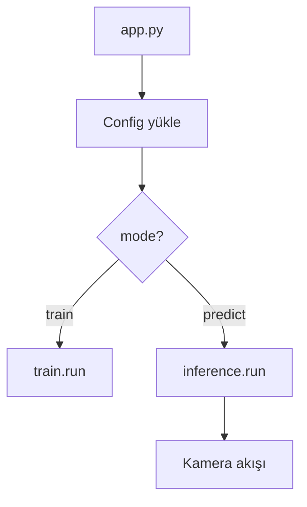

# Computer Vision Pipeline

TOML tabanlı yapılandırma ile eğitim ve çıkarım süreçlerini yöneten modüler bir görüntü işleme pipeline'ı.

## Features

- Tüm parametreler tek bir TOML dosyasından yönetilir, kod içinde hardcoded değer yoktur
- `mode` ayarına göre eğitim veya çıkarım süreci otomatik tetiklenir
- Ortam bazlı yapılandırma desteği (`--env local`, `--env prod`)
- Loguru tabanlı seviyeli loglama (debug / info / warning / error)

## Project Structure

```
.
├── app/
│   ├── config.py       # TOML config yükleyici
│   ├── logger.py       # Loglama sınıfı
│   ├── camera.py       # Kamera yönetimi
│   ├── train.py        # Eğitim süreci
│   └── inference.py    # Çıkarım süreci
├── configs/
│   ├── config.local.toml
│   └── config.prod.toml
├── app.py              # Giriş noktası
└── requirements.txt
```

## Installation

```bash
conda create -n cv python=3.11 -y
conda activate cv
pip install -r requirements.txt
```

## Usage

```bash
python app.py --env local
```

Çalışma modu `configs/config.local.toml` dosyasındaki `mode` değeri ile belirlenir:

```toml
mode = "train"      # veya "predict"
```

## Configuration

| Bölüm | Anahtar | Açıklama |
|---|---|---|
| — | `mode` | Çalışma modu: `train` veya `predict` |
| `logger` | `filepath` | Log dosyasının yolu |
| `logger` | `rotation` | Log dosyası boyut limiti |
| `camera` | `source` | Kamera indeksi (0 = varsayılan) veya video yolu |
| `camera` | `width` | Kare genişliği |
| `camera` | `height` | Kare yüksekliği |

## Flowchart

