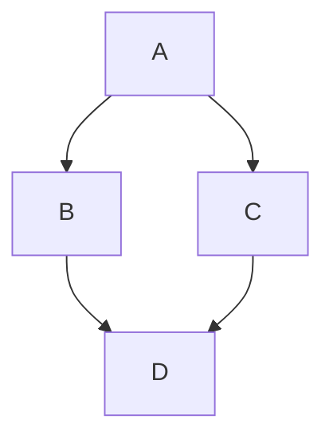

## Installation
```bash
conda create -n cv python=3.11 -y
conda activate cv
pip install -r requirements.txt

```

## Usage
```bash
python main.py --env local
```

## Docker Build
```bash
```

## Docker Run
### Debug
```bash
```
### Prod
```bash
```

## Docker-Compose Run
```bash
docker-compose up --build
```

## Flowchart
